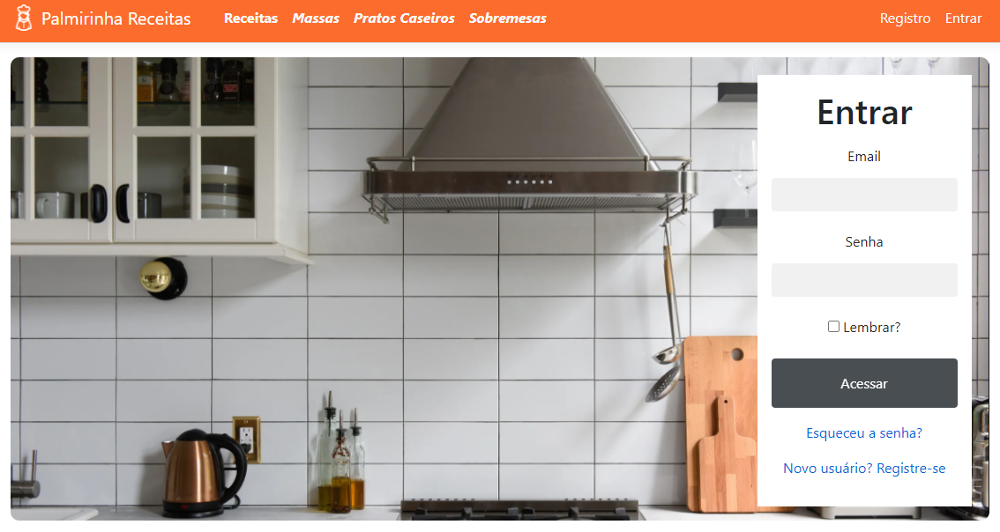
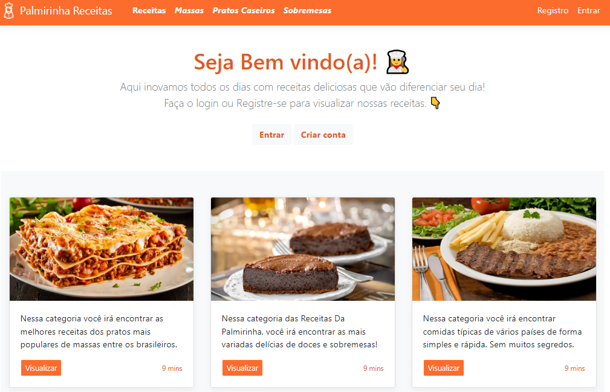
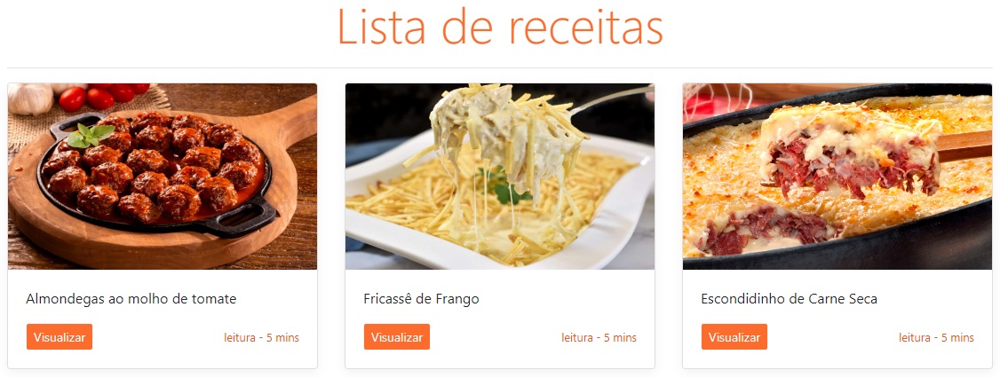
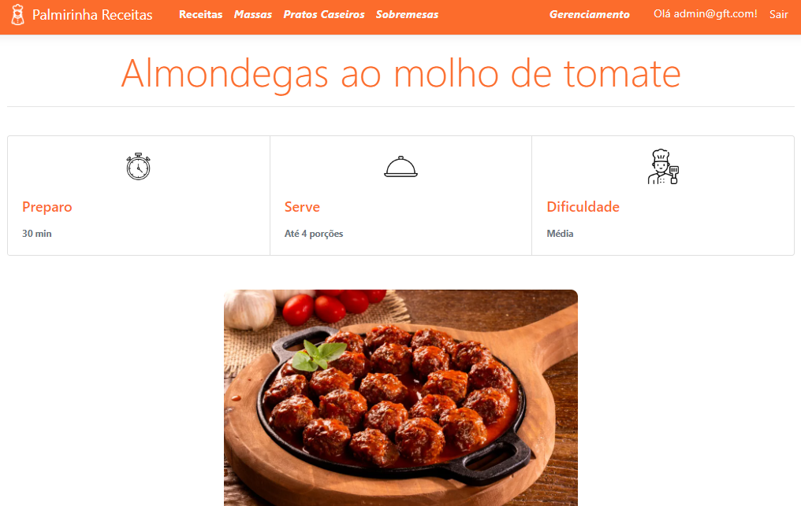

# Receitas da Palmirinha 👩‍🍳

Projeto focado em desenvolvimento web com arquitetura [MVC](https://www.lewagon.com/pt-BR/blog/o-que-e-padrao-mvc), com proposito final de criar um website de receitas com possibilidade de gerenciamento utilizando [CRUDS.](https://devporai.com.br/o-que-e-crud-e-porque-voce-deveria-aprender-a-criar-um/)

<br>

## 🏁 Desafios propostos

### [Regras do projeto](/docs/Desafio%20MVC(Gerenciador%20de%20Receita%20).pdf)
<br>

## 📂Estrutura do Projeto
<br>

**📂 Models**
<p>Contém todas as entidades da aplicação.</p>

**📂 DTO**
<p>Contém todas as entidades da aplicação com validações aplicadas.</p>

<br>


## ⚙️ Dependências para execução do projeto
<br>
 
- Ter instalado e configurado o MySQL

- Configurar conexão local com banco de dados no appsetings.json

<br>


## ▶️ Executando o projeto
<br>

### Configurando conexão local com o banco de dados:
<br>

```bash
Crie uma base dados no workbench e digite o nome dela em #DataBase

{
    "DefaultConnection": "Server=localhost;DataBase=NomeDoBanco;
    port=3306 Uid=root;Pwd=SenhaDoSeuBanco"
}

```

### Acesse o diretorio da aplicação e execute a migração de dados pro banco:
<br>

```bash
# cd DESAFIO-MVC/

# dotnet ef database update
```
### Rode os seguintes comandos e desfrute das funcionalidades:
<br>

```bash
# dotnet restore
# dotnet watch run
```

### Usuários padrão da aplicação:
<br>

- admin@gft.com
- usuario@gft.com
- Senha: Gft@1234

<br>

## 👨🏻‍💻 Tecnologias utilizadas


- [DotNet 5.0](https://dotnet.microsoft.com/en-us/download/dotnet/5.0)


## 📸 Prévias visuais do projeto
<br>





